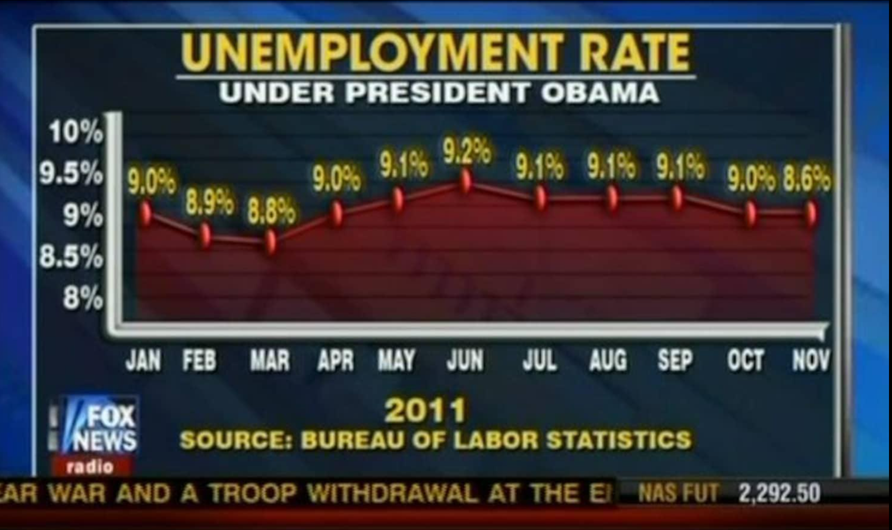
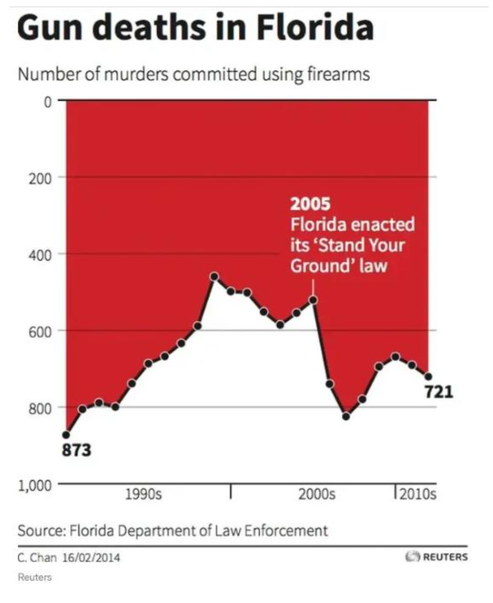
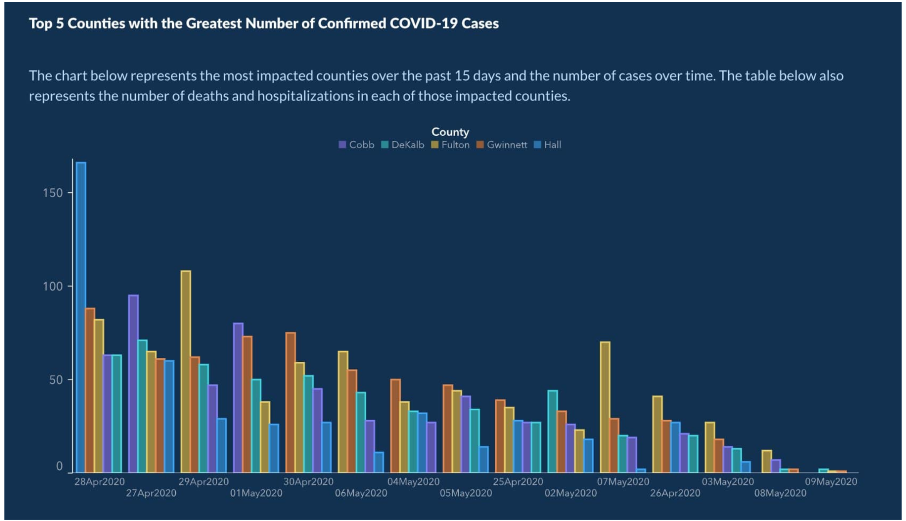

# Exemples de visualisations trompeuses

Ces trois visualisations montrent des erreurs de représentation graphique.  
Les données affichées peuvent être exactes, mais leur **mise en forme modifie fortement la perception du lecteur**.

> Important : une visualisation trompeuse n'implique pas nécessairement une volonté de manipuler. Le problème peut également venir d'une erreur de conception ou d'un mauvais choix graphique.

---

## 1. Fox News — taux de chômage aux États-Unis, 2011

### Ce qui ne va pas

Le principal problème est que **la position verticale des points ne correspond pas aux valeurs indiquées**.

Le cas le plus évident est celui de novembre :

- octobre : **9,0 %** ;
- novembre : **8,6 %**.

Pourtant, le point de novembre est dessiné pratiquement **au même niveau que celui d'octobre**.  
Il devrait au contraire être nettement plus bas et même se situer sous le point de mars, qui vaut **8,8 %**.

Le graphique ne respecte donc pas correctement sa propre échelle.

### Pourquoi c'est trompeur

La forme de la courbe donne visuellement l'impression que le chômage reste presque stable autour de 9 %, alors que la valeur affichée passe de **9,0 % à 8,6 %**.

Le lecteur interprète généralement la hauteur des points avant de lire précisément chaque valeur. Une mauvaise position des points peut donc modifier directement le message perçu.

L'axe vertical est également limité à environ **8 %–10 %**. Ce choix n'est pas forcément incorrect pour une courbe, mais il **accentue visuellement les petites variations** et exige donc une représentation particulièrement rigoureuse.

---

## 2. Reuters — *Gun deaths in Florida*

### Ce qui ne va pas

L'axe vertical est **inversé** :

- **0** est placé en haut ;
- **1 000** est placé en bas.

Cela signifie que lorsque le nombre de morts augmente, la courbe **descend**.

C'est l'inverse de la convention utilisée dans la grande majorité des graphiques, où une valeur plus élevée est représentée plus haut.

### Pourquoi c'est trompeur

Après l'indication de la loi *Stand Your Ground* de 2005, la courbe descend brutalement.

Visuellement, une courbe qui descend est généralement interprétée comme une **diminution**. Or ici, elle correspond au contraire à une **augmentation du nombre de morts par arme à feu**.

Par exemple, une valeur proche de 500 avant cette période est suivie de valeurs dépassant 700 puis 800. Comme l'axe est inversé, cette hausse numérique apparaît graphiquement comme une chute.

Le graphique demande donc au lecteur de **lutter contre une convention visuelle très forte**.

**Type d'erreur :** axe Y inversé / codage visuel contre-intuitif.

---

## 3. Georgia Department of Public Health — cas de COVID-19

### Ce qui ne va pas

Le problème principal se situe sur **l'axe horizontal** : les dates ne sont pas placées dans l'ordre chronologique.

On peut notamment lire :

`28 Apr → 27 Apr → 29 Apr → 01 May → 30 Apr → 06 May → 04 May → 05 May → 25 Apr → 02 May → 07 May → 26 Apr → 03 May → 08 May → 09 May`

Il ne s'agit donc pas d'une véritable série temporelle ordonnée.

Pourtant, le texte du graphique indique qu'il représente le nombre de cas **"over time"**, ce qui conduit naturellement le lecteur à interpréter l'axe de gauche à droite comme une progression temporelle.

### Pourquoi c'est trompeur

Les groupes de barres les plus élevés sont principalement placés à gauche et les plus faibles à droite.

Cela crée visuellement une **forte tendance à la baisse**, comme si le nombre de cas diminuait progressivement avec le temps.

Mais puisque les dates sont mélangées, cette pente visuelle **ne représente pas l'évolution chronologique réelle**.

Le lecteur peut donc conclure à une amélioration de la situation sanitaire simplement en regardant la forme générale du graphique.

Le grand nombre de séries et de couleurs rend en outre l'ordre des dates moins visible, ce qui facilite la mauvaise interprétation.

### Comment corriger le graphique

Il faut classer l'axe X strictement par date :

`25 Apr → 26 Apr → 27 Apr → 28 Apr → 29 Apr → 30 Apr → 01 May → 02 May → 03 May → 04 May → 05 May → 06 May → 07 May → 08 May → 09 May`

On pourrait ensuite comparer réellement l'évolution des différents comtés au cours du temps.

**Type d'erreur :** axe temporel non chronologique.

---

## Synthèse

| Visualisation | Problème principal | Effet sur la perception |
|---|---|---|
| Fox News — chômage | Points mal positionnés par rapport aux valeurs | Minimise visuellement la baisse du chômage |
| Reuters — morts par armes à feu | Axe Y inversé | Une hausse des décès ressemble à une baisse |
| Georgia COVID-19 | Dates dans le désordre | Crée artificiellement une tendance décroissante |

## Conclusion

Ces trois exemples illustrent trois règles fondamentales de la visualisation de données :

1. **La position graphique doit correspondre exactement aux valeurs.**
2. **Les axes doivent suivre des conventions compréhensibles et explicites.**
3. **Une série temporelle doit être présentée dans l'ordre chronologique.**

Une visualisation peut afficher des chiffres corrects tout en transmettant un message visuel faux ou fortement biaisé.
