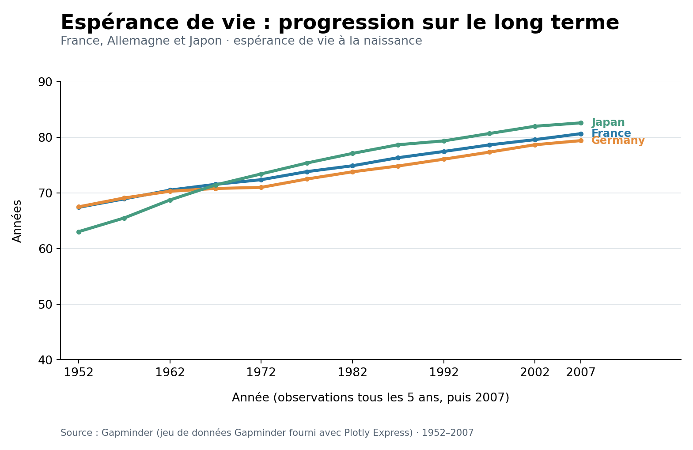
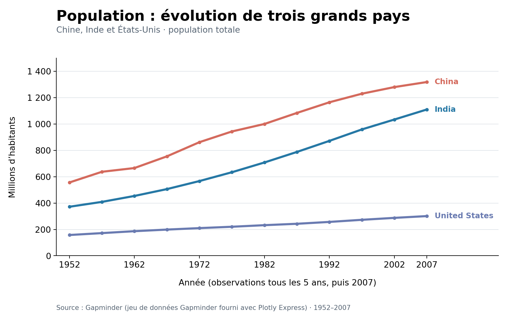
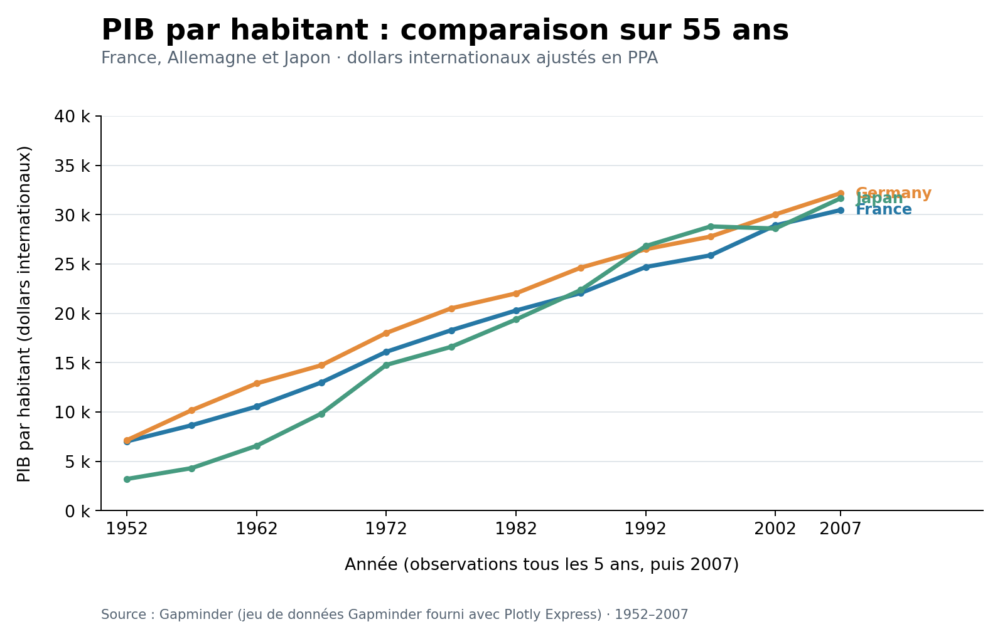

# Exemples de visualisations temporelles bien conçues

Ces trois graphiques en courbes montrent comment représenter correctement **des évolutions dans le temps**, sans modifier visuellement le sens des données.  
Leur objectif est de faciliter la lecture de la tendance, des écarts et des ordres de grandeur, tout en conservant les informations indispensables à leur interprétation.

> Important : aucun graphique n'est entièrement neutre. Le choix de la période, des pays et des axes influence toujours la lecture. Un bon graphique rend ces choix explicites et n'affirme pas davantage que ce que les données permettent de montrer.

---

## 1. Gapminder — évolution de l'espérance de vie, 1952–2007

### Ce qui est bien fait

L'axe horizontal respecte **l'ordre chronologique**, avec des années positionnées selon leurs distances réelles. Les valeurs sont représentées sur un **axe vertical linéaire, croissant de bas en haut**, et exprimé en années.

- Les trois pays utilisent **la même échelle**, ce qui permet une comparaison directe.
- Les courbes et leurs **étiquettes à droite** évitent de confondre les pays.
- La période **1952–2007** et l'indicateur « espérance de vie à la naissance » sont précisés.
- Les points montrent la fréquence des observations disponibles : **tous les cinq ans jusqu'en 2002, puis 2007**. Les segments entre deux points ne doivent pas être interprétés comme des données annuelles mesurées.

### Pourquoi ce n'est pas trompeur

On voit à la fois **l'amélioration générale de l'espérance de vie** et les différences de trajectoire entre pays, notamment la forte progression du Japon après 1952. Aucun décalage artificiel des courbes ni inversion d'axe ne vient changer le sens des évolutions.

L'axe ne part pas de zéro, ce qui est acceptable pour des courbes visant à comparer des variations, dès lors que **ses bornes sont visibles** et qu'on ne présente pas la hauteur comme une quantité proportionnelle.

---

## 2. Gapminder — évolution de la population, 1952–2007

### Ce qui est bien fait

Le graphique compare **la population totale de trois pays sur la même période**, en utilisant une échelle verticale commune et des unités clairement indiquées : **millions d'habitants**.

- L'axe vertical **commence à zéro**, afin de conserver une bonne perception des niveaux de population.
- Les dates sont ordonnées et espacées conformément au temps écoulé.
- Les trois courbes sont identifiées directement, sans légende éloignée du graphique.
- Le titre et le sous-titre distinguent clairement la **population totale** d'un taux de croissance ou d'une densité.

### Pourquoi ce n'est pas trompeur

La représentation permet de constater que la Chine reste plus peuplée que l'Inde **sur toute la période étudiée**, alors que les deux populations progressent fortement. Les États-Unis apparaissent à un niveau inférieur, sans que leur trajectoire soit volontairement amplifiée.

Le choix d'un axe allant jusqu'à **1,5 milliard d'habitants** conserve les ordres de grandeur. Il serait en revanche incorrect d'utiliser cette courbe ancienne pour affirmer quoi que ce soit sur le classement actuel de ces populations.

---

## 3. Gapminder — PIB par habitant, 1952–2007

### Ce qui est bien fait

Le graphique représente un même indicateur économique pour trois pays, avec **un axe vertical linéaire partant de zéro** et une unité commune : le **PIB par habitant en dollars internationaux ajustés en parité de pouvoir d'achat (PPA)**, tel qu'il figure dans ce jeu de données.

- Les trois séries sont comparables car elles utilisent **la même variable et la même échelle**.
- L'axe des années est chronologique, et les observations sont repérables grâce aux points.
- Les couleurs sont constantes et accompagnées d'étiquettes textuelles.
- Le graphique ne mélange pas le **PIB total** et le **PIB par habitant**, deux mesures qui ne racontent pas la même chose.

### Pourquoi ce n'est pas trompeur

La visualisation rend visible la progression du PIB par habitant dans les trois pays ainsi que le **rattrapage économique du Japon** au cours de la période. Le lecteur peut comparer les niveaux sans être induit en erreur par des échelles verticales distinctes.

Il faut toutefois éviter de conclure que cette mesure décrit à elle seule le niveau de vie des habitants : **elle ne renseigne ni sur la répartition des revenus ni sur l'ensemble des dimensions du bien-être**.

---

## Source des données

Les trois graphiques ont été réalisés à partir du **jeu de données Gapminder intégré à Plotly Express**, qui contient des observations espacées de cinq ans entre **1952 et 2007**. Il s'agit de **représentations originales**, et non de captures de graphiques publiés par Gapminder.

- [Gapminder — données et documentation](https://www.gapminder.org/data/)
- [Plotly Express — jeu de données Gapminder](https://plotly.com/python/px-arguments/#gapminder-dataset)

Les graphiques permettent de comparer les évolutions historiques dans le périmètre présenté. Ils ne doivent pas être interprétés comme des données actualisées en 2026.
